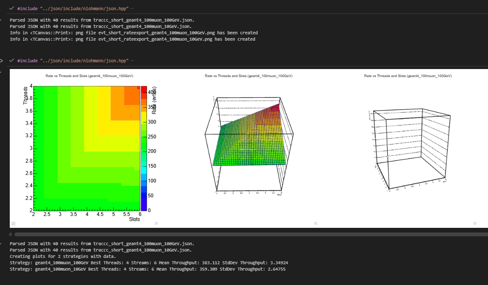

# Running performance scans with the pixeltrack scan tool

Currently has to run from the build directory.

Quick test, ran from the build directory:

```bash
$ export TRACCC_TEST_DATA_DIR=/scratch/data
ls -1 /scratch/data/odd-simulations-20240509/ | head -2 | for d in `cat`; do ./run-scan/run-scan.py --numThreads `seq -s, 2 2 4` --numStreams `seq -s, 2 4 6` --eventsPerStream 100 -o /shared/sched-traccc/measurements/traccc_short_${d} --repeat 10 --tryAgain 1 --cudaDevices 0 ./run-scan/run-scan-wrapper.sh -- -- --input-directory odd-simulations-20240509/$d --finding-run-mbf-smoother=0 ; done
```

The generated `*.json` files are then processed with the ROOT notebook: `evt_rate_export.ipynb`:



They require the json header libreary fron https://github.com/nlohmann/json.

Full scan parameters:
```bash
$ export TRACCC_TEST_DATA_DIR=/scratch/data
ls -1 /scratch/data/odd-simulations-20240509/ | for d in `cat`; do ./run-scan/run-scan.py --numThreads `seq -s, 2 2 32` --numStreams `seq -s, 2 4 48` --eventsPerStream 100 -o /shared/sched-traccc/measurements/traccc_${d} --repeat 10 --tryAgain 1 --cudaDevices 0 ./run-scan/run-scan-wrapper.sh -- -- --input-directory odd-simulations-20240509/$d --finding-run-mbf-smoother=0 ; done
```